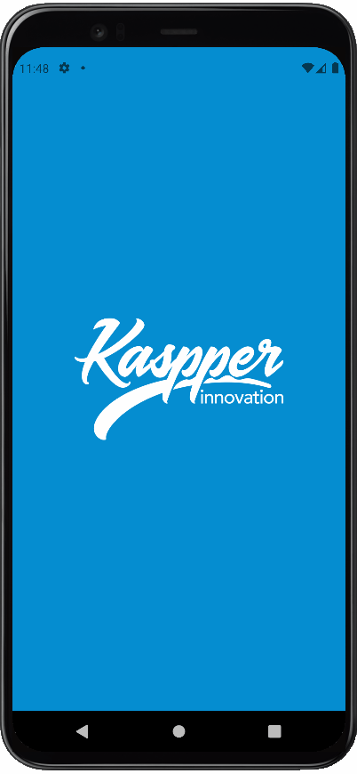
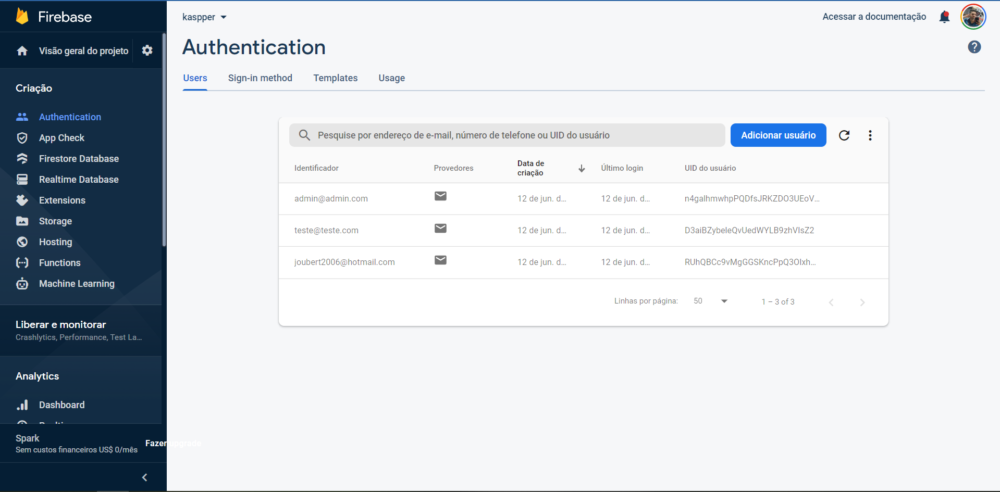
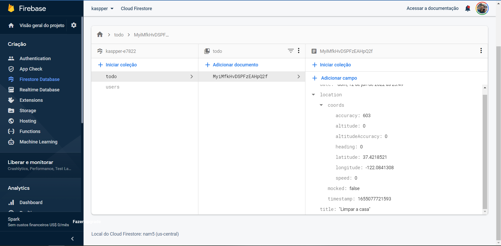

# Teste RV DIGITAL 

> O Desafio - NotePad
Seu objetivo é criar um aplicativo para realizar as suas anotações. Ele deve consultar, registrar e deletar uma anotação. Para cada anotação deve ser registrado a localização do usuário. 

</br>

> Pré-requisitos:
• context-api para gerenciar o estado global da aplicação e realizar as operações
• react-navigation para navegar entre as telas
• styled-components para estilizar a aplicação

</br>

</br>
<div align="center">
 

</div>
</br>

# O que foi feito

- No lugar de só salvar os dados localmente, você pode se cadastrar e fazer login em um banco de dados na núvem(Firebase). Podendo criar, alterar e apagar as anotações, pegando a data de hoje e sua localização.
Ao fazer login ou criar a conta os dados do usuário são salvos localmente.

# Link para download android

- [APK](https://expo.dev/artifacts/d85fa8db-3742-48f5-b01c-6372c7851b69)

</br>

## Installing / Getting started

```bash
# Clone o repositório
$ git clone git@github.com:arcorreiaa/kaspper.git

# Entre na pasta
$ cd kaspper

# Instale as dependencias
$ yarn install

# Inicie o site
$ yarn start
```

## Developing

- [Expo](https://expo.io/)
- [React Native](https://reactnative.dev/)
- [Yarn Workspaces](https://classic.yarnpkg.com/en/docs/workspaces/)
- [Firebase](https://firebase.google.com/)
- [React-native-async-storage](https://react-native-async-storage.github.io/async-storage/docs/install/)
- [Expo-location](https://docs.expo.dev/versions/latest/sdk/location/)


## Database

- [Firebase - Authentication](https://firebase.google.com/docs/auth?hl=pt-br)

Responsavel por fazer a autenticação de novos usuários, criando um ID único.



- [Firebase - Firestore](https://firebase.google.com/docs/firestore?hl=pt-br)

Responsavel por salvar os dados para exibição e edição de novos usuários, cadastrando com o mesmo ID criando na autenticação.



</br>

<div align="center">

 </div>
